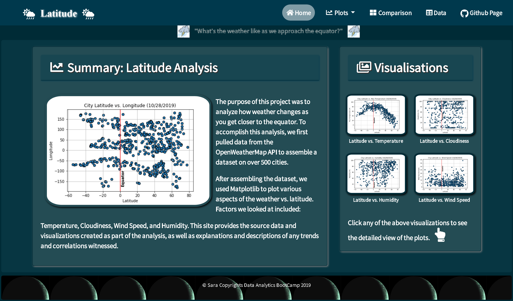

# Web-Challenge
## Latitude Analysis Dashboard with Attitude

#### Live Link of the Website : <https://saranyapandiaraj.github.io/Web-Challenge/Home_Page.html>

#### Note: Before Clicking the Live Link, Please clear the browser cache to affect the css style changes in the website.

Web Visualization Dashboard (Latitude) site provides the source data and visualizations created as part of the WeatherPy - latitude analysis, as well as explanations and descriptions of any trends and correlations witnessed.

The website contains of 7 pages total, including:

* A [landing page](#landing-page) containing:
  * An explanation of the project.
  * Links to each visualizations page.
* Four [visualization pages](#visualization-pages), each with:
  * A descriptive title and heading tag.
  * The plot/visualization itself for the selected comparison.
  * A paragraph describing the plot and its significance.
* A ["Comparisons" page](#comparisons-page) that:
  * Contains all of the visualizations on the same page so we can easily visually compare them.
  * Bootstrap grid for the visualizations.
* A ["Data" page](#data-page) that:
  * Displays a responsive table containing the data used in the visualizations.
    * The table has a bootstrap table component.
    
## Folder Structure

1) Css --> Contains the Css files, svg, images.
2) Output City Data --> It Has the City Source Data
3) Plotted Figures --> It has all the visualizations.
4) Media Queries --> It has the Media Responsive snapshots.
